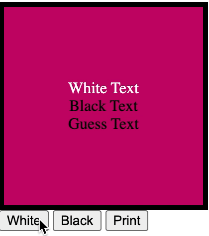

using ai meta library brainjs to build a machine learning model

brainjs: GPU accelerated Neural Networks in JavaScript, for Browsers and Node.js.

## Machine Learning - Colors

## The Goal
Use an AI library to make predictions for what color text to use, given the background color provided

## Technology Stack:

| Technology    	| Use           	  | Description     										  |
| :------------------|:-------------------| :----------------										  |
| BrainJS 			| AI     | PU accelerated Neural Networks in JavaScript, for Browsers and Node.js.

## Project Specifications
Train AI to know what color to make text overlaying a colored background.

The color of the text will be either white or black, depending on what the AI thinks is best.

-allow user to select white or black

-store the user selections

-use the stored selections as data for further decisions

## Anatomy of Project

| File/Folder    	| Purpose           	  |
| :------------------|:-------------------|
| index.html	 			| structure, presentation     |
| script.js		 			| JavaScript code|
| xor-test/		 			| preliminary ai testing    |

## Demo

## License
MIT License

Copyright (c) 2020 Frank Santaguida

Permission is hereby granted, free of charge, to any person obtaining a copy
of this software and associated documentation files (the "Software"), to deal
in the Software without restriction, including without limitation the rights
to use, copy, modify, merge, publish, distribute, sublicense, and/or sell
copies of the Software, and to permit persons to whom the Software is
furnished to do so, subject to the following conditions:

The above copyright notice and this permission notice shall be included in all
copies or substantial portions of the Software.

THE SOFTWARE IS PROVIDED "AS IS", WITHOUT WARRANTY OF ANY KIND, EXPRESS OR
IMPLIED, INCLUDING BUT NOT LIMITED TO THE WARRANTIES OF MERCHANTABILITY,
FITNESS FOR A PARTICULAR PURPOSE AND NONINFRINGEMENT. IN NO EVENT SHALL THE
AUTHORS OR COPYRIGHT HOLDERS BE LIABLE FOR ANY CLAIM, DAMAGES OR OTHER
LIABILITY, WHETHER IN AN ACTION OF CONTRACT, TORT OR OTHERWISE, ARISING FROM,
OUT OF OR IN CONNECTION WITH THE SOFTWARE OR THE USE OR OTHER DEALINGS IN THE
SOFTWARE.